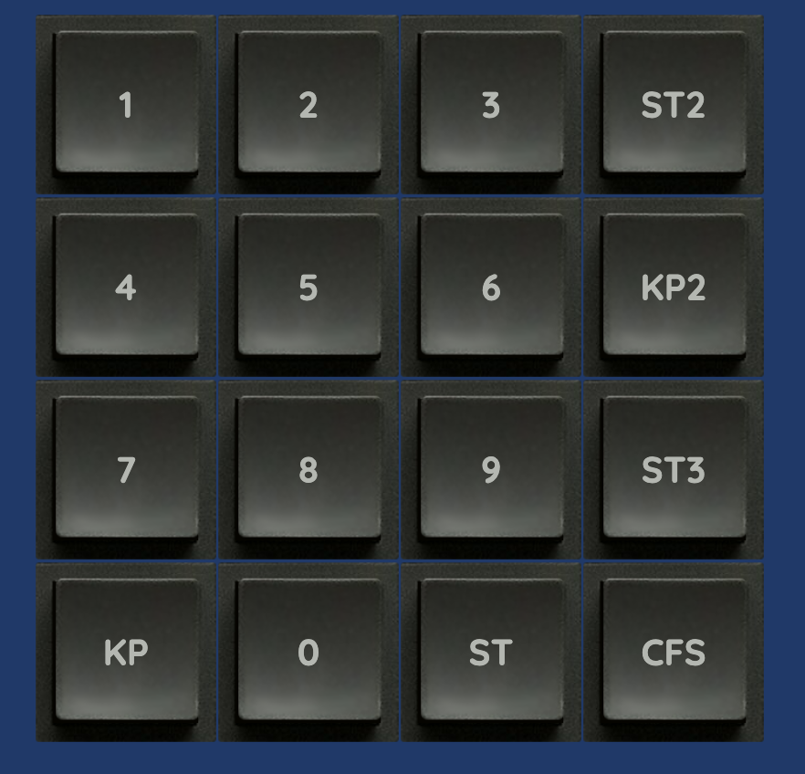

# BlueJS
A simple HTML 5 Blue Box for CCITT Signalling System 5 (C5)- or whatever you want really.

Try it out [here](https://dreadtech.com/bluebox/).


Proudly using the [vanilla.js framework](http://vanilla-js.com/)




```
SPDX-License-Identifier: GPL-3.0-only
(c) Veghead 2023
``````
